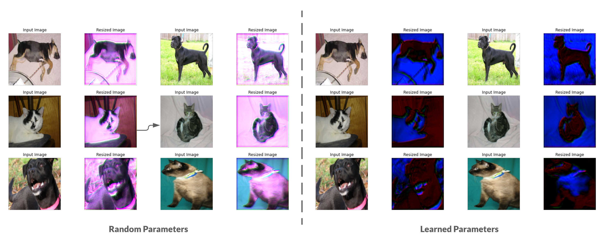

# Learnable-Image-Resizing
TensorFlow 2 implementation of [Learning to Resize Images for Computer Vision Tasks](https://arxiv.org/abs/2103.09950v1) by Talebi et al.

Accompanying blog post on keras.io: [Learning to Resize in Computer Vision](https://keras.io/examples/vision/learnable_resizer/).

The above-mentioned paper proposes a simple framework to optimally learning representations for a given network architecture and given image resolution (such as 224x224). The authors find that the representations that are more coherent with the human perception system _may not always_ improve the performance of vision models. Instead, optimizing the representations that are better suited for the models can substantially improve their performance. 

The diagram presents the proposed learnable resizer module (source: original paper):

<div align="center">
</img>
</div>
<br>

Here's how the resized images look like after being passed through a learned resizer:

<div align="center">



</div>

On the left hand side, we see the outputs of an untrained learnable resizer. On the right, the outputs are from the same learnable resizer but with **10 epochs of training**. The images may not make sense to our eyes in terms of their perceptual quality, but they help to improve the recognition performance of the vision models.

## About the notebooks
* `Standard_Training.ipynb`: Shows how to train a DenseNet-121 on the Cats and Dogs dataset with bilinear resizing (150 x 150).
* `Learnable_Resizer.ipynb`: Shows how to train the same network with the learnable resizing module included. Here, the inputs are first resized to 300 x 300 and then the learnable resizer module helps learn optimal representations for 150 x 150. 

These incorporate mixed-precision training along with distributed training. 

## Results
|           Model           	| Number of  parameters (Million) 	| Top-1 accuracy 	|
|:-------------------------:	|:-------------------------------:	|:--------------:	|
|   With learnable resizer  	|             7.051717            	|      67.67%     	|
| Without learnable resizer 	|             7.039554            	|      60.19%      	|

Both the models were trained for only 10 epochs from the same initial checkpoint.

You can reproduce these results with the model weights provided [here](https://github.com/sayakpaul/Learnable-Image-Resizing/releases/tag/v1.0.0).

## Paper citation

```
@InProceedings{Talebi_2021_ICCV,
    author    = {Talebi, Hossein and Milanfar, Peyman},
    title     = {Learning To Resize Images for Computer Vision Tasks},
    booktitle = {Proceedings of the IEEE/CVF International Conference on Computer Vision (ICCV)},
    month     = {October},
    year      = {2021},
    pages     = {497-506}
}
```

## Acknowledgements
* [ML-GDE program](https://developers.google.com/programs/experts/) for providing GCP credit support. 
* Mark Doust (of Google) for feedback. 
